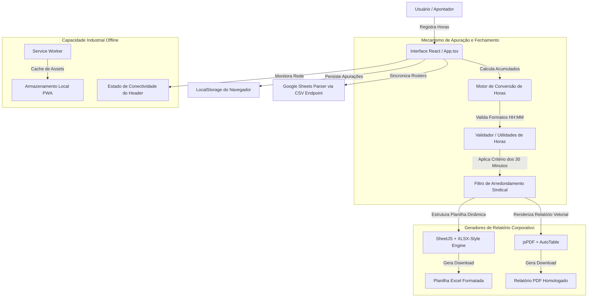

# Servitium - Horas Extras
> **Controle de Apuração e Consolidação de Horas Extras e Adicionais Noturnos para a Folha de Pagamento**

[](#)
[](#)
[](LICENSE)
[](#)
[](#)

---

## 📌 Índice

1. [Sobre o Projeto](#-sobre-o-projeto)
2. [Principais Funcionalidades](#-principais-funcionalidades)
3. [Tecnologias Utilizadas](#-tecnologias-utilizadas)
4. [Arquitetura do Sistema](#-arquitetura-do-sistema)
5. [Estrutura do Projeto](#-estrutura-do-projeto)
6. [Pré-requisitos](#-pré-requisitos)
7. [Instalação e Execução](#-instalação-e-execução)
8. [Configuração](#-configuração)
9. [Guia de Utilização](#-guia-de-utilização)
10. [Documentação Técnica](#-documentação-技术-documentação-técnica)
11. [Armazenamento e Persistência de Dados](#-armazenamento-e-persistência-de-dados)
12. [Segurança e Conformidade](#-segurança-e-conformidade)
13. [Testes](#-testes)
14. [Contribuição](#-contribuição)
15. [Roadmap de Desenvolvimento](#-roadmap-de-desenvolvimento)
16. [FAQ - Perguntas Frequentes](#-faq---perguntas-frequentes)
17. [Suporte e Contatos](#-suporte-e-contatos)
18. [Licença](#-licença)

---

## 🏢 Sobre o Projeto

O **Servitium - Horas Extras** é um sistema corporativo de alto desempenho e alta densidade informacional, desenvolvido especialmente para a gestão, lançamento, auditoria e consolidação de horas extras e adicionais noturnos dos colaboradores terceirizados alocados na **COMPESA** (Companhia Pernambucana de Saneamento) pela **Servitium**.

O sistema atua na unidade operacional **ETA Pirapama (GPM/CMA Sul)**, onde a apuração precisa da jornada de trabalho e adicionais industriais (como insalubridade, periculosidade e adicional de condutor) é crítica para o fechamento da folha de pagamento e o faturamento do contrato com a estatal.

### ⚠️ O Problema que Resolve
No setor de saneamento e infraestrutura de grande porte, o registro e a apuração de horas extras costumam ser descentralizados e propensos a falhas manuais. A conversão de horários em frações decimais, o cálculo de adicionais de 50% e 100% (incluindo prorrogações noturnas diferenciadas) e a aplicação de regras sindicais específicas podem gerar inconformidades trabalhistas ou perdas financeiras.

O **Servitium - Horas Extras** elimina esses riscos por meio de:
* Lançamentos diários rápidos e intuitivos.
* Inteligência automatizada de cálculos de horas com base na data (detectando sábados, domingos e feriados nacionais automaticamente).
* **Critério dos 30 minutos** pré-configurado para arredondamento legal de fechamento de folha.
* Exportação direta para relatórios executivos homologados em formato **Microsoft Excel (XLSX)** estruturado e **Adobe PDF** com diagramação idêntica ao padrão de faturamento de contratos corporativos.

### 👥 Público-Alvo
* **Coordenadores e Apontadores de Campo:** Profissionais que realizam o lançamento diário dos horários trabalhados.
* **Analistas de DP e RH da Servitium:** Responsáveis pela conferência de dados e consolidação do fechamento mensal para a folha de pagamento.
* **Gestores de Contrato COMPESA:** Fiscais responsáveis por revisar a documentação de faturamento dos terceirizados.

### 🎯 Benefícios e Diferenciais
* **Filosofia de Design de Alta Densidade (Bloomberg/Stripe-Style):** Toda a jornada, os KPIs acumulados e o fechamento do mês ficam disponíveis acima da dobra, sem espaços em branco desnecessários ou transições lentas.
* **Capacidade Offline-First (PWA):** Funciona totalmente sem sinal de internet em locais remotos de operação industrial. Os dados salvos localmente são sincronizados imediatamente ao recuperar a conexão.
* **Sincronização de Dados via Planilha de Controle:** Atualiza automaticamente o cadastro de colaboradores por meio de uma planilha pública do Google Sheets em segundo plano, eliminando cadastros duplicados.

---

## ⚡ Principais Funcionalidades

O sistema está estruturado em 4 grandes módulos operacionais altamente interligados:

```
[MÓDULO 01: Período] ──> [MÓDULO 02: Colaborador] ──> [MÓDULO 03: Lançamento Diário] ──> [MÓDULO 04: Consolidação]
```

### 📅 Módulo 01 — Seleção de Período de Apuração
* **Objetivo:** Definir o mês e o ano de referência da apuração das horas trabalhadas.
* **Funcionalidades:** Seletor intuitivo de período com atualização imediata dos calendários diários.
* **Regras de Negócio:** 
  * O sistema atualiza em tempo real as propriedades de cada dia do mês correspondente (se é dia útil, sábado, domingo ou feriado nacional cadastrado).
  * Limita os lançamentos do mês à quantidade correta de dias (28, 29, 30 ou 31 dias).

### 👥 Módulo 02 — Alocação de Colaboradores
* **Objetivo:** Identificar e carregar o perfil contratual, matricial e documental do trabalhador.
* **Funcionalidades:**
  * Busca instantânea por nome, matrícula ou CPF.
  * Carregamento em segundo plano do cadastro mestre de funcionários direto de um link do Google Sheets.
  * Exibição de metadados críticos: CNH/Habilitação, recebimento de Vale Transporte (VT), Vale Alimentação (VA), Adicional de Condutor, Periculosidade e Insalubridade.

### ✍️ Módulo 03 — Lançamento Diário e Produtividade em Lote
* **Objetivo:** Permitir o registro dos adicionais e das horas extras acumuladas em cada dia do mês.
* **Funcionalidades:**
  * Lançamento rápido de **Hora Extra 50%**, **Hora Extra 100%**, **Adicional Noturno 50%** e **Adicional Noturno 100%** diretamente em formato de hora (`HH:MM`).
  * Identificação visual de fins de semana (sábados e domingos) com coloração de fundo e marcação de feriados nacionais do ano de referência.
  * **Preenchimento em Lote (Bulk Fill):** Permite preencher uma coluna inteira de forma instantânea de duas maneiras:
    1. *Apenas dias úteis:* Ignora sábados, domingos e feriados (perfeito para horas regulares de segunda a sexta).
    2. *Todos os dias:* Preenche do dia 1 ao último dia do mês corrente.
  * **Limpeza em Lote:** Limpa uma coluna inteira com um único clique.
  * **Painel de Acumulado de Lançamentos:** Exibição dinâmica de um card lateral contendo os KPIs consolidados em tempo real para o colaborador selecionado.

### 📑 Módulo 04 — Consolidação, Fechamento e Exportação
* **Objetivo:** Agregar as apurações individuais em um relatório de faturamento consolidado de toda a unidade operacional.
* **Funcionalidades:**
  * **Transferência com 1 Clique:** Envia os totais do colaborador ativo diretamente para a planilha de fechamento.
  * **Tabela Consolidada Mutável:** Permite editar dados consolidados de qualquer colaborador sem perder a apuração detalhada.
  * **Critério dos 30 minutos:** Filtro inteligente que arredonda de forma automática as horas extras registradas no relatório, aproximando para intervalos de 30 minutos, em conformidade com as regras de apuração sindical industrial.
  * **Exportação Corporativa para Excel:** Gera um arquivo de planilha (`XLSX`) formatado com o logotipo da empresa, tabelas mescladas, design premium nas cores institucionais e metadados completos de pagamento (VT, VA, Periculosidade, Condutor, etc.).
  * **Exportação Corporativa para PDF:** Produz um relatório em orientação de paisagem (`landscape`), ideal para impressão e arquivamento legal.

---

## 🛠️ Tecnologias Utilizadas

| Tecnologia | Categoria | Finalidade |
| :--- | :--- | :--- |
| **React 19** | Frontend Framework | Biblioteca principal para construção de componentes e gestão de reatividade. |
| **TypeScript** | Linguagem | Garante tipagem estática forte, prevenindo erros em runtime na apuração de horas. |
| **Vite 6** | Build Tool | Servidor de desenvolvimento rápido e bundler de produção de alta performance. |
| **Tailwind CSS v4** | CSS Framework | Estilização por classes utilitárias, garantindo o design de alta densidade visual. |
| **Lucide React** | Icons | Conjunto de ícones vetoriais modernos e escaláveis. |
| **Motion** | Animation | Biblioteca leve para animações fluidas de abertura de modais e transições de tela. |
| **SheetJS (XLSX)** | Data Export | Motor de processamento para geração e formatação de planilhas Excel nativas. |
| **XLSX JS Style** | Styling Export | Permite estilizar fontes, bordas e fundos dentro do arquivo XLSX exportado. |
| **jsPDF & AutoTable** | PDF Generator | Motor para geração de relatórios PDF diagramados diretamente no cliente. |
| **Google Sheets API** | Integration | Conexão para sincronização dinâmica do cadastro mestre de colaboradores. |

---

## 📐 Arquitetura do Sistema

O sistema foi desenhado seguindo princípios modernos de arquitetura de cliente único (Single Page Application - SPA) aliado a recursos de PWA para permitir resiliência industrial offline.

### 🖼️ Diagrama de Fluxo de Dados e Integração



### Detalhamento da Camada Cliente
1. **Engine de Tempo e Conversão:** Localizada em `src/utils/hours.ts`, converte cadeias de texto no formato `HH:MM` para inteiros em minutos para somas seguras, e reconverte para o formato textual antes de exibi-los ou armazená-los. Isso previne bugs aritméticos comuns de frações de 100 minutos.
2. **Camada de Sincronização Dinâmica:** Realiza requisições assíncronas do tipo `fetch` para o endpoint de visualização CSV pública do Google Sheets. Caso ocorram erros de conectividade, utiliza uma base de colaboradores pré-carregada (`src/data/employees.ts`) de modo imperceptível ao operador de campo.

---

## 📂 Estrutura do Projeto

Abaixo está o mapeamento completo da árvore de diretórios do repositório, detalhando a finalidade de cada pasta e arquivo chave para manutenibilidade:

```
├── .env.example                       # Modelo de variáveis de ambiente do projeto
├── .gitignore                         # Instruções de exclusão para o Git
├── index.html                         # Ponto de entrada HTML do aplicativo
├── metadata.json                      # Configurações de metadados de plataforma e permissões
├── package.json                       # Manifesto do projeto, scripts NPM e dependências
├── tsconfig.json                      # Configuração do compilador TypeScript
├── vite.config.ts                     # Configuração do compilador Vite
├── assets/                            # Assets do sistema de gerenciamento interno
├── public/                            # Recursos públicos estáticos servidos diretamente
│   ├── favicon.png                    # Ícone do navegador
│   ├── manifest.json                  # Manifesto de instalação da aplicação PWA
│   ├── sw.js                          # Service Worker para controle de cache offline
│   └── icons/                         # Biblioteca de ícones em múltiplos tamanhos para PWA
├── scripts/
│   └── generate-icons.cjs             # Script utilitário para redimensionamento automático de ícones
└── src/                               # Diretório principal de desenvolvimento do código-fonte
    ├── main.tsx                       # Ponto de entrada do renderizador React no DOM
    ├── index.css                      # Importação do Tailwind CSS v4 e estilos globais de scroll
    ├── App.tsx                        # Componente Raiz: controlador de estado e layout principal
    ├── types.ts                       # Declarações globais de tipos e interfaces TypeScript
    ├── assets/
    │   └── logoConstant.ts            # Logotipo oficial em base64 pré-processado para exportação PDF
    ├── components/                    # Componentes modulares da interface
    │   ├── PeriodSelector.tsx         # Componente seletor de mês/ano de referência (Módulo 1)
    │   ├── EmployeeSelector.tsx       # Componente buscador e selecionador de funcionários (Módulo 2)
    │   ├── DailyLaunchTable.tsx       # Tabela interativa para lançamentos de horas diárias (Módulo 3)
    │   ├── TotalsCard.tsx             # Card lateral de KPIs, acumulados e transferência de dados (Módulo 3)
    │   ├── ConsolidatedTable.tsx      # Painel de faturamento final e exportações XLSX/PDF (Módulo 4)
    │   └── PWAHandler.tsx             # Gestor do ciclo de vida e notificações de instalação PWA
    ├── data/
    │   └── employees.ts               # Cadastro de contingência estático com funcionários pré-carregados
    └── utils/                         # Motores de lógica reutilizável
        ├── dateUtils.ts               # Tratamento de calendário, fins de semana e feriados nacionais
        ├── googleSheets.ts            # Motor de parsing de planilhas e mapeamento inteligente de colunas
        └── hours.ts                   # Utilitários matemáticos para apuração de minutos e arredondamentos
```

---

## 🟢 Pré-requisitos

Para instalar, compilar e executar o sistema localmente, certifique-se de possuir em seu ambiente de desenvolvimento:

* **Sistema Operacional:** Linux (Ubuntu 20.04 ou superior), macOS (11 ou superior) ou Windows (10 ou 11) com terminal Bash ou PowerShell.
* **Node.js:** Versão ativa em Long Term Support (LTS), recomendada a versão **`20.x`** ou superior.
* **NPM / Bun:** Gerenciador de pacotes NPM (nativo do Node) ou **Bun** (recomendado para instalação ultra rápida usando o `bun.lock` presente).

---

## 🚀 Instalação e Execução

Siga os passos técnicos abaixo para colocar a aplicação em execução local:

### 1. Clonagem do Repositório
```bash
git clone https://github.com/seu-usuario/servitium-horas-extras.git
cd servitium-horas-extras
```

### 2. Instalação de Dependências
Você pode utilizar o gerenciador de pacotes de sua preferência. O projeto já inclui suporte para instalações via NPM ou Bun.

**Utilizando NPM:**
```bash
npm install
```

**Utilizando Bun:**
```bash
bun install
```

### 3. Inicialização do Servidor de Desenvolvimento
Após instalar os pacotes, execute o comando abaixo para subir o servidor local na porta padrão `3000`:

```bash
npm run dev
```

Abra o navegador e acesse: [http://localhost:3000](http://localhost:3000)

### 4. Compilação para Produção
Para gerar os arquivos estáticos de produção, otimizados, limpos e minificados dentro do diretório `dist/`:

```bash
npm run build
```

### 5. Execução do Preview de Produção
Para testar o build de produção localmente simulando o comportamento real de distribuição:

```bash
npm run preview
```

### 6. Estratégias de Deploy
O sistema é uma Single Page Application estática e pode ser implantado gratuitamente em qualquer serviço de hospedagem web moderno:

* **Netlify:** O repositório já inclui um arquivo `netlify.toml` pré-configurado para builds instantâneos baseados em Git.
* **Vercel:** Arquivo `vercel.json` configurado para deploys com um clique.
* **GitHub Pages / Cloudflare Pages:** Basta apontar o diretório de publicação para `dist/`.

---

## ⚙️ Configuração

### Arquivos de Configuração Chave
* `vite.config.ts`: Configurado para compilar o plugin oficial do React, Tailwind CSS e habilitar as definições de escopo de rede seguras.
* `public/manifest.json`: Controla os metadados visuais de exibição da aplicação no dispositivo móvel do usuário final (tema de cores escuro `#090a0f`, ícones, orientação de exibição).

### Variáveis de Ambiente (`.env.example`)
Crie um arquivo `.env` na raiz do projeto caso queira customizar as variáveis abaixo:

```env
# URL da Planilha do Google Sheets para o cadastro de Colaboradores
# O sistema já aponta por padrão para uma planilha institucional segura.
VITE_GOOGLE_SHEETS_URL=https://docs.google.com/spreadsheets/d/1uI1Td022bYP-NTZd2VrjCjwVSz5XrMV1ib-z-13_YkE/edit?gid=0#gid=0
```

---

## 📖 Guia de Utilização

Siga este passo a passo para executar a apuração mensal sem erros:

1. **Defina o Período:** No primeiro card superior, selecione o **Mês** e o **Ano** desejados. Note que o cabeçalho mudará informando o período de referência ativo.
2. **Selecione o Colaborador:** Utilize a barra de buscas para digitar o nome, matrícula ou CPF. Clique no funcionário para carregá-lo.
3. **Lance as Horas:** 
   * Na tabela diária, insira os valores de Hora Extra (`HE 50%`, `HE 100%`) ou adicionais noturnos nos campos dos dias em que houve trabalho excedente.
   * *Dica de Produtividade:* Para colaboradores que fazem uma jornada adicional padrão de segunda a sexta, clique no botão **"Úteis"** no cabeçalho da coluna, digite a hora padrão (ex: `02:00`) e confirme. A coluna será preenchida pulando os finais de semana de forma automática.
4. **Transfira para o Fechamento:** Com todas as horas preenchidas, avalie os totais acumulados no card lateral azul e clique em **"Transferir para Fechamento"**. Os dados serão gravados na lista consolidada abaixo.
5. **Aplique o Critério de Arredondamento:** Se a convenção sindical da sua unidade operacional exigir o fechamento em janelas cheias de 30 minutos, clique no botão **"Aplicar Critério dos 30 Minutos"** no bloco 04. O sistema processará todos os colaboradores ativos aplicando as regras legais.
6. **Exporte os Relatórios:** 
   * Clique em **"Exportar Excel"** para obter o faturamento formatado para auditoria.
   * Clique em **"Exportar PDF"** para obter o relatório com assinatura ideal para aprovações físicas ou digitais com a fiscalização do contrato.

---

## 📚 Documentação Técnica

> Consulte toda a documentação técnica do projeto para compreender sua arquitetura, requisitos, processos de desenvolvimento e infraestrutura.

| Documento | Descrição | Link |
| :--- | :--- | :--- |
| **Lista de Requisitos** | Detalhamento dos requisitos funcionais e não-funcionais estabelecidos para o faturamento COMPESA. | [docs/requisitos-funcionais.md](docs/requisitos-funcionais.md) |
| **Especificação de Regras de Negócio** | Detalhes sobre cálculo de adicional noturno, horas prorrogadas e conversões matemáticas. | [docs/regras-negocio.md](docs/regras-negocio.md) |
| **Modelagem de Dados Local** | Documento técnico contendo a estrutura detalhada de chaves e versionamento do LocalStorage. | [docs/modelagem-dados.md](docs/modelagem-dados.md) |
| **Manual de Integração Google Sheets** | Instruções de permissões para publicação e vinculação de novas planilhas no sistema. | [docs/google-sheets.md](docs/google-sheets.md) |

---

## 💾 Armazenamento e Persistência de Dados

### Modelo Offline-First com LocalStorage
Para evitar perdas de dados operacionais devido a quedas abruptas de conexão de rede ou desligamentos imprevistos do dispositivo de coleta, o sistema implementa uma camada híbrida de persistência baseada na API cliente do **LocalStorage**:

```
[Entrada de Lançamentos] ──> [State Temporário React] ──> [LocalStorage (servitium-consolidated)]
```

* Os registros de fechamento consolidados são gravados de forma assíncrona sob a chave `servitium-consolidated`.
* O cadastro atualizado de colaboradores obtido do Google Sheets é gravado em cache na chave `servitium-employees` para permitir inicialização instantânea no carregamento da tela mesmo sem conectividade de internet.

---

## 🛡️ Segurança e Conformidade

Por se tratar de um sistema para processamento e controle de dados pessoais e de pagamentos, foram adotados os seguintes mecanismos de proteção:

1. **Protocolo SSL de Transporte:** Toda a comunicação de sincronização com o barramento do Google Sheets ocorre estritamente por túnel seguro criptografado (HTTPS).
2. **Conformidade com a LGPD:** O sistema exibe o CPF dos colaboradores de forma mascarada, garantindo que telas públicas ou relatórios não exponham documentação civil em conformidade com as diretivas da Lei Geral de Proteção de Dados.
3. **Sandboxing de Memória Local:** Os dados lançados permanecem na sandbox protegida de memória local do navegador utilizado para a apuração. A Servitium não trafega informações de jornada de trabalho por servidores de terceiros não homologados.

---

## 🧪 Testes

O projeto conta com scripts para validação de sintaxe e verificação da integridade do código Typescript.

**Executar Verificação de Tipos (TypeScript Linter):**
```bash
npm run lint
```

Este comando valida se não há variáveis órfãs, importações quebradas ou desrespeito a regras de tipagem estática que poderiam causar quebras em produção.

---

## 🤝 Contribuição

Para manter o código seguro, escalável e padronizado, siga as diretrizes abaixo para contribuições:

### Fluxo de Trabalho Git (Git Flow)
1. **Criar uma Branch de Feature:** Nunca realize commits diretamente na branch `main`. Crie uma branch específica:
   ```bash
   git checkout -b feature/nome-da-melhoria
   ```
2. **Convenção de Mensagens de Commit:** Utilize commits semânticos:
   * `feat:` Adição de novas funcionalidades.
   * `fix:` Correção de bugs ou arredondamentos.
   * `docs:` Alterações na documentação (ex: README).
   * `style:` Formatação de layout ou classes Tailwind.
3. **Submissão de Pull Request (PR):** Envie suas alterações e abra um Pull Request detalhando as alterações visuais e de lógica aplicadas. Aguarde a revisão de segurança e design do Tech Lead antes do merge.

---

## 🗺️ Roadmap de Desenvolvimento

Funcionalidades planejadas para as próximas iterações do sistema:

- [ ] **Módulo de Geolocalização de Lançamento:** Registrar as coordenadas geográficas do apontamento no momento da finalização para fins de auditoria de auditor operacional COMPESA.
- [ ] **Integração direta com ERP Senior:** Canal de exportação automatizada no formato JSON homologado pelo ERP de folha de pagamento da Servitium.
- [ ] **Multi-unidades:** Suporte para apurações paralelas em diferentes ETAs (ETA Jaboatão, ETA Suape) no mesmo painel de controle.

---

## 💬 FAQ - Perguntas Frequentes

### 1. O sistema funciona sem internet?
**Sim.** Graças à arquitetura PWA e ao cache offline de ativos configurado no arquivo `public/sw.js`, você pode abrir e utilizar a ferramenta completa mesmo em locais sem qualquer sinal telefônico ou de rede wifi. Ao reconectar, as planilhas sincronizadas em cache atualizarão normalmente.

### 2. O que acontece se eu limpar o cache do meu navegador?
Como os dados consolidados são gravados de forma segura na memória `LocalStorage` local do navegador, se você realizar uma limpeza completa de dados do navegador ("Limpar todos os dados do site"), as apurações que não foram exportadas para PDF ou Excel serão apagadas. **Recomenda-se realizar a exportação frequente de seus relatórios consolidados.**

### 3. Como posso cadastrar um novo colaborador na planilha oficial?
Os colaboradores são geridos diretamente na Planilha de Controle de Recursos Humanos da Servitium. Ao adicionar ou alterar uma linha na planilha oficial do Google Sheets vinculada, o sistema atualizará automaticamente o cadastro de colaboradores na próxima inicialização em segundo plano.

---

## 📞 Suporte e Contatos

Em caso de problemas técnicos, falhas de sincronização de planilhas ou dúvidas operacionais, entre em contato com a Controladoria da Servitium:

* **E-mail de Atendimento Corporativo:** [controladoria@servitium.com.br](mailto:controladoria@servitium.com.br)
* **Canal Interno Slack / Chat:** `#servitium-cma-sul`
* **Telefone de Plantão Técnico:** (81) 3216-4400 — Ramal 104

---

## 📄 Licença

Este projeto é um software proprietário e de uso exclusivo da **Servitium Industrial S.A.** e seus clientes parceiros homologados. Todos os direitos reservados. Licenciado para operação sob a licença **Apache License 2.0** contida neste repositório.

---
*Documento homologado pela Controladoria de Processos Internos e Tecnologia da Informação da Servitium.*
